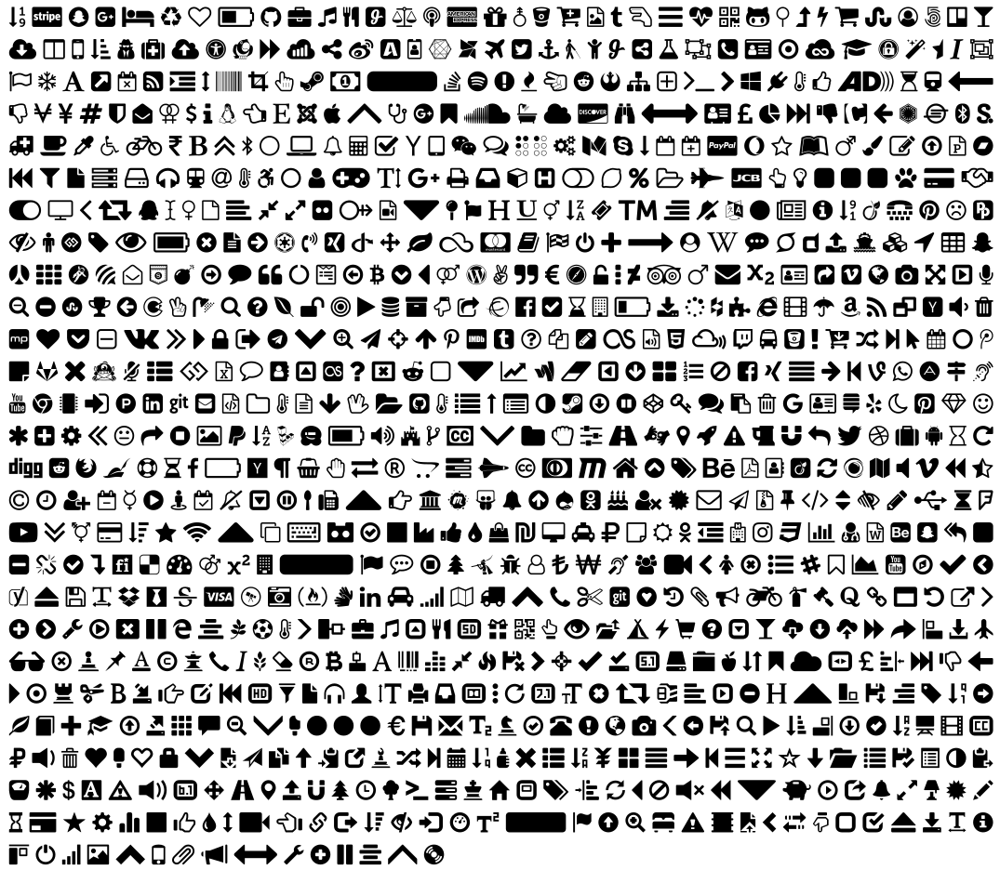

# glyphicons2tikz
I wrote this tool because I wanted to use glyphicons in a paper of mine. It's quite simple to use. The output of this tool results in an svg file for each glyphicon- and tex-file for direct integration into latex. At the moment, it gives you access to the icons of bootstrap and fontawesome but you're free to add other icons.

# Installation
```bash
# install dependencies
sudo apt-get install git nodejs npm python -y
# install svg2tikz
git clone https://github.com/kjellmf/svg2tikz
cd svg2tikz
sudo python setup.py install
# install glyphicons2tikz
git clone https://github.com/chrisdecker1201/glyphicons2tikz
cd glyphicons2tikz
# copy configuration
cp config.json.sample config.json
npm install
npm start
```

# Usage
The default of the script gives you black icons, but you can change the color in the _config.json_ to every possible color. Use HTML standard, for example: #ff00ff.

To use the icons in latex add the following packages to your file and maybe define a new command.

```latex
\usepackage{tikz}
\usepackage{standalone}

\newcommand{\icon}[1]{\includestandalone[height=9pt]{tikz/#1}}
```

I configured the output of the tool with the _tikz_\__output_-parameter into my latex project and now I can write a paragraph like this:
```latex
\icon{bootstrap/eye-open}I really love to use many icons in my text \icon{fontawesome/linux}
```

# Configuration
The width of an icon may differ from the default values given in the _config.json_ but you can change them as in the following example. Be free to upload your changes by copying them to the _config.json.sample_. 

For example: I found out that the linux icon from fontawesome is too wide. So I opened the configured svg-file and changed the width parameter to the width I wanted to have: 1550px. Now just append the following lines to your fontawesome-section in the _config.json_.
```json
"linux":{
    "width": 1550
}
```
You can also override the __height__, translation in X(__translateX__) and translation in Y (__translateY__) direction, but translation in Y-direction must be multiplied with the factor "-1" because I had to mirror all icons.

# Versions
* v1.1.1 update packages
* v1.1.0 added fontawesome support
* v1.0.0 bootstrap support

------------------------------------------------
Please read LICENSE file for licensing details.

# Screenshot in Latex

